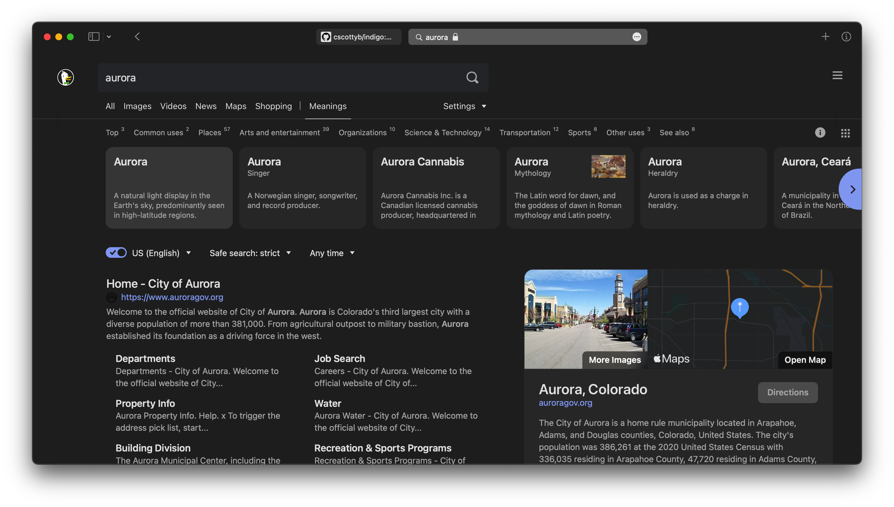

# Indigo

 ##### DuckDuckGo theming project.
 ###### Alpha v0.1.0

## Features
- Updated UI using css properties like backdrop-filter.
- Light/Dark themes.
- Coming in Beta: SASS customization.
- Coming Soon: Support for Blink, Mozilla, and Webkit browsers.
- Coming Soon: WGAC AA compliant color scheme for better accessibilities.

## How to use
Indigo themes will only override css styles on the DuckDuckGo landing page and the search results pages through a desktop browsers. No styling for mobile devices or the official app.

- Download and Unzip latest Release to your file directory from https://github.com/cscottyb/indigo/releases
- Find the .css file you want to use by selection browser and variants parameters.
- ALPHA MESSAGE: For the best experience for *all* browser, select a theme from the `compatible` folder.   

### Safari
Indigo was developed for Safari first and will have the best theming thanks to native support for backdrop-filter. It is recommend to use the Safari theme.
- Open Safari Settings and navigate to `Preferences > Advanced > Style sheet`
- Navigate to the .css file from the downloaded folder.

### Blink and Mozilla based browsers (Chrome and Firefox)
You'll need to install a plugin from your browser's extensions store that will allow you to override the default css style on any webpage. I recommend the *Stylus* extensions that are available for both browsers. Make sure you target all pages on the duckduckgo.com domain.
- Open the theme file for the browser you want to use Indigo in your text editor (Notepad, Text Edit).
- Copy and paste the css code into the textfield and save.

### Firefox
Firefox users can use the more advanced chrome theme by changing Advanced Preferences settings.
- From the Firefox browser, enter `about:config` into the address bar.
- Click through the warning message if you understand the message about overriding Firefox features.
- In the `Search preference name` field, search for **backdrop-filter**.
- Set* the value for `layout.css.backdrop-filter.enable` to `true`.
- Like before, search for `gfx.webrender.all` setting and set* it to `true`.
- Restart Firfox and enjoy.

\* click the two-way arrow on the right to easily change settings.

### Browsers on slower and older computers
You may want to stick to the compatible themes since other Indigo themes use resources to render some features. Your mileage may vary.

## Roadmap
### Alpha v0.1.x
- Constant updates and releases of themes files.
- Few project package releases.
- No issues reporting or pull-request during this phase. The project will be constantly changing and fixing bug reports is time consuming at this stage in development.

### Beta v0.2.x
- Package ready for easy user customization.  
- Release of packages for easy modification through command prompt.
- Open bug reporting open for theme edits.

### Release Candidates v0.3.x
- Release of speciality themes: Windows, WGAC AA, etc.
- Clean codebase.
- Open bug reporting open for package edits.

### Release v1.0.0
- File structure finalized.
- Official themes and package release.    
- Pull request available from official contributors.

### Release v2.0.0
- GUI

## Known Issues as of Alpha-v0.1.0
### Design
- Header doesn't play nice with Safari theme due to backdrop-filter and DuckDuckGo default styling. Fix, reconstruct header using a different position properties.
- Map's direction UI redesign isn't finished.
- Browsers handles the backdrop filters differently.
- Browser prefixes haven't been added.

### NPM Build
- Errors generated during npm run scripts due to migration to Dart SASS
- Dart SASS logic not rendering images correctly in duo themes, like back-button on map page.
- Time consuming setup to create theme.

## Contribute
- **Submit issues when BETA is released**.
- Buy me a cup of coffee, link coming soon.
